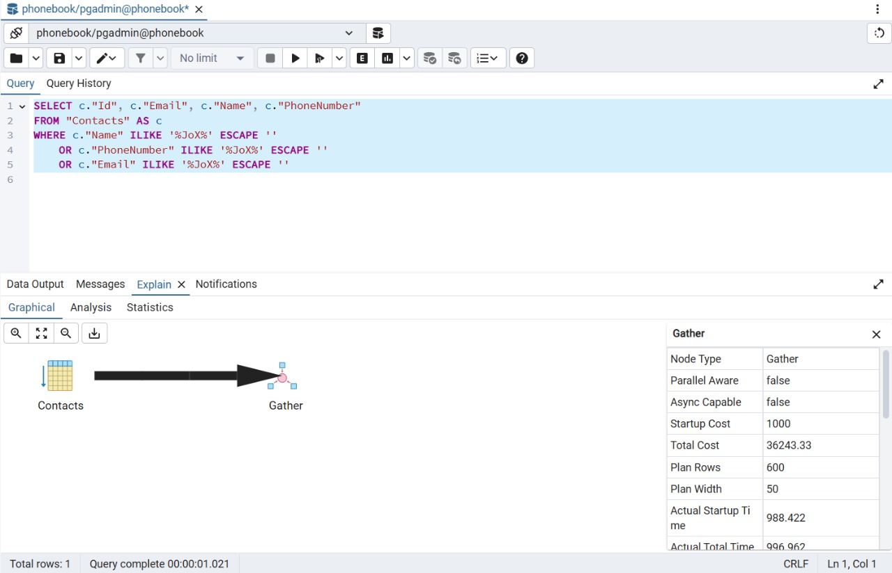
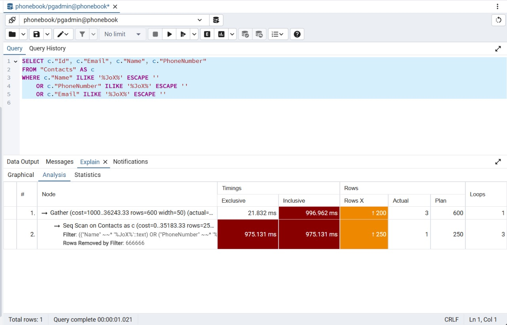
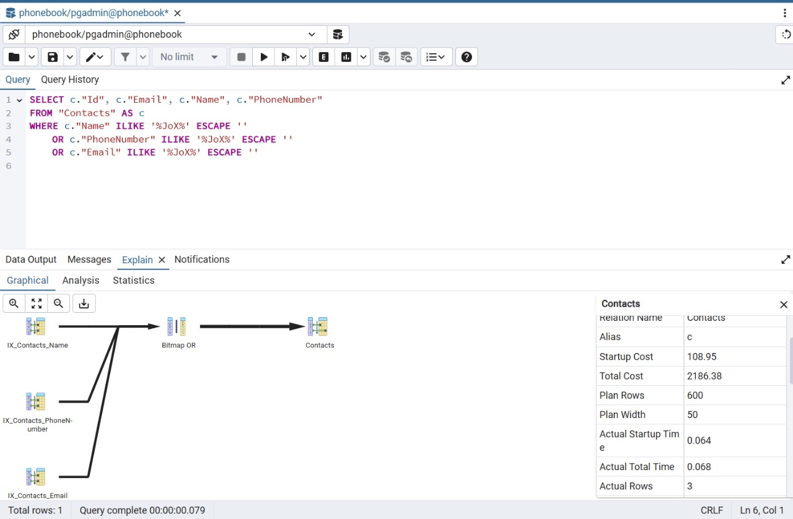
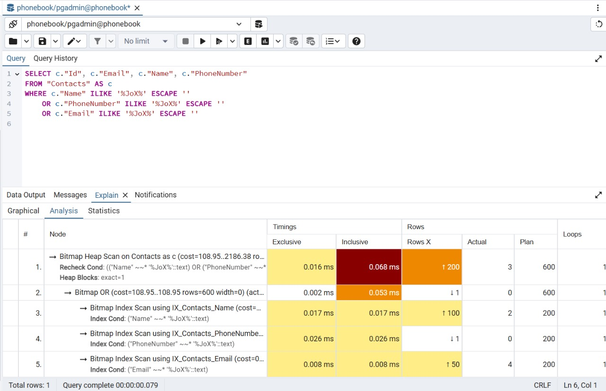

# Phonebook


## Optimizations 
To improve query performance, **I optimized the database by adding GIN indexes with the gin_trgm_ops operator, resulting in a 94% reduction in query execution cost.** This optimization significantly enhances the efficiency of text-based searches by leveraging trigram indexing.


> [!NOTE]
> I measered the cost after seeding the database with 1 million row.

### Cost & Time Before Indexes



### Cost & Time After Indexes



## 🛠️ Setup & Run 
### 1. Prerequisites  
- Install [Docker](https://www.docker.com/) and [Docker Compose](https://docs.docker.com/compose/install/).  
- Clone the repository:  
```bash  
git clone https://github.com/Youssef-Adell/Phonebook-API.git 
cd Phonebook
```

### 2. Start the API  
Run the following command to build and start the containers:  
```bash 
cd Backend
docker-compose up --build  
```

- The API will be available at http://localhost:5000.
- The Database will be accessible at localhost:5432.


### 3. Start the Application  
Run the following command to start the application:  
```bash  
cd Frontend
ng serve 
```

- The Application will be available at http://localhost:4200.
